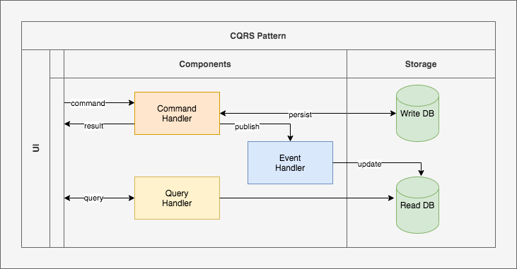

# CQRS: (Command Query And Responsibility Segregation)
## Right way of doing DDD (Domain Driven Development)

- CQRS enforce segregation of read and write data model.
- CQRS is derived from CQS (Command Query Separation), the term mentioned for the first time in a book by Bertrand Mayer (Object Oriented Software Construction).
- It's main idea is split application majorly in two parts:
  - Query
    - These are the read models that are going to fetch data, without modifying the state.
  - Command
    - These are the write models that modify the state. 
- The domain object has to implement functions for fetching and modifying the state. Each function can either read or write but not both.

### Run Axon Server Docker Container

    docker run -p 8024:8024 -p 8124:8124 axoniq/axonserver
    
- 8024: Http Port
- 8124: gRPC Port

### Run MongoDB Docker Container

    docker run -e POSTGRES_PASSWORD=admin123 -e POSTGRES_USER=admin -p 5432:5432 postgres
    
    
### Kafka Docker Container
    
    docker run --rm -p 2181:2181 -p 3030:3030 -p 8081-8083:8081-8083 \
           -p 9581-9585:9581-9585 -p 9092:9092 -e ADV_HOST=192.168.0.18 \
           lensesio/fast-data-dev:latest    
           
- Visit http://192.168.0.18:3030 to get into the fast-data-dev environment           

### Run RabbitMQ in Docker Container

    docker run -d -p 15672:15672 -p 5672:5672 -e RABBITMQ_DEFAULT_USER=user -e RABBITMQ_DEFAULT_PASS=password rabbitmq:3-management
    
- 15672: Http Port
- 5672: AMQP Port    