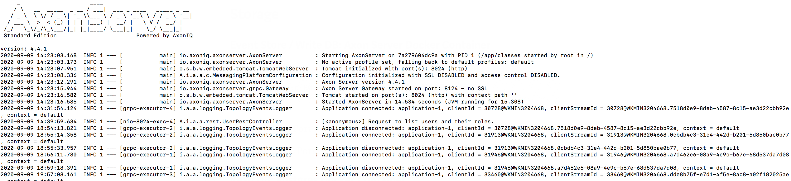

# CQRS: (Command Query And Responsibility Segregation)
## Right way of doing DDD (Domain Driven Development)

- CQRS enforce segregation of read and write data model.
- CQRS is derived from CQS (Command Query Separation), the term mentioned for the first time in the book by Bertrand Meyer (Object Oriented Software Construction).
- It's main idea is split application majorly in two parts:
  - Query
    - These are the read models that are going to fetch data, without modifying the state.
  - Command
    - These are the write models that modify the state. 
- The domain object has to implement functions for fetching and modifying the state. Each function can either read or write but not both.

## Components and system requirements
### Command Handling Component
- Validate the command.
- Provide a place holder to implement logic based on which the event has to trigger.

### Event Handling Component
#### Event Sourcing Handler
- Asynchronously receives event.
- Persist event in Write DB 
#### Event Handler
- Asynchronously receives event.
- Can publish the projected state in Read DB. 

### Query Handling Component
- Query projected results from Read DB.

### These components are wired using
- Spring Boot
- Axon Framework
- Kotlin

## Storage
### Event Store / Write DB: Axon Server Docker Container

    docker run -p 8024:8024 -p 8124:8124 axoniq/axonserver
    
- 8024: Http Port
- 8124: gRPC Port

### Read DB: Postgres Docker Container

    docker run -e POSTGRES_PASSWORD=admin123 -e POSTGRES_USER=admin -p 5432:5432 postgres
    